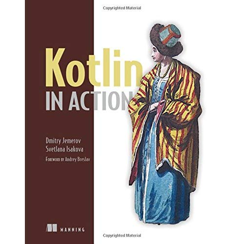
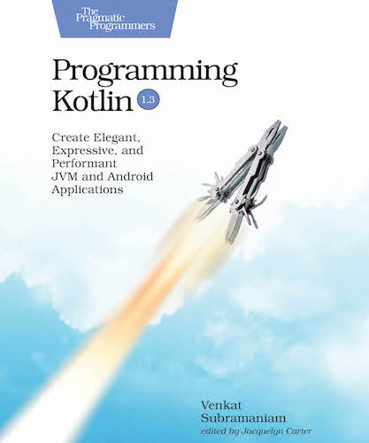

---?image=assets/img/kotlin-logo2.png&size=cover

---
@snap[span-100]
### Agenda
@snapend

* Historien til Kotlin
* Hvorfor Kotlin?
* Designfilosofi
  * Interop med Java
  * Pragmatisk
  * Verktøy støtte
* Spring support
* Kotlin bøker

----?video=https://video.twimg.com/tweet_video/DyUYJpkXQAAoWnE.mp4&loop=true&muted=true

---?image=assets/img/kotlin-github.jpg&size=contain
---?image=assets/img/kotlin-digi.jpg&size=contain
---?image=assets/img/hvorfor-kotlin.jpg&size=contain

---
@snap[span-100]
### Hvorfor Kotlin?
@snapend

* Kotlin er offisielt språk for Android
* Tilgang til hele Java økosystemet
* Ikke big-bang, kan implementeres litt etter litt
* Verktøystøtte

---
@snap[span-100]
### Hvorfor Kotlin?
@snapend

* Interoperabilitet med  Java
  * Java -> Kotlin
  * Kotlin -> Java

---

* Mindre kode for å oppnå samme funksjonalitet
  * *Rough estimates indicate approximately a 40% cut in the number of lines of code* (JetBrains)

---

* God verktøystøtte

---

*Kotlin is in itself a polyglot language.
It brings together the powerful capabilities from many different languages.
The creators of Kotlin took the good parts from various languages and combined them into one highly approachable and pragmatic language.*
- Venkat Subramaniam

---

* *Dedicated Kotlin support in Spring Framework 5.0*

<iframe class="stretch" data-src="https://docs.spring.io/spring-boot/docs/current/reference/html/boot-features-kotlin.html"></iframe>

---?image=assets/img/most-loved.png&size=contain
@snap[south text-black span-100]
**Stack overflow survey 2019**
@snapend

---?image=assets/img/most-dreaded.png&size=contain

---
@snap[span-100]
### Kotlin resources
@snapend

)

---
@snap[span-100]
### Kotlin resources
@snapend

